<h3><code>geetha@github ~ $ whoami</code></h3>

<picture>
  <source media="(max-width: 600px)" srcset="./assets/profile-mobile.svg" />
  
</picture>

**Turning data noise into insights—and insights into something useful.**

[Marketing analytics](https://github.com/geethasagarb/Marketing_Analytics_Portfolio_Project) · [Forecasting with FRED](https://github.com/geethasagarb/-Forecasting-U.S.-Construction-Spending-FRED-)

Databricks Data Engineer Associate · Power BI Data Analyst (PL-300)

[LinkedIn](https://www.linkedin.com/in/gitageetha) · [Explore my projects](https://github.com/geethasagarb?tab=repositories)

